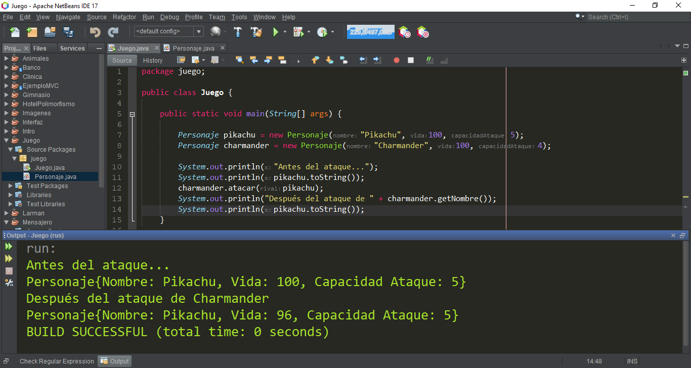

# Actividad 02 - Juego/Personajes

### Consigna:
Crear una clase llamada __Personaje__ dentro del paquete juego que permita la ejecución del código proporcionado en la clase __Juego__.




### Código base proporcionado:
```java
package juego;

public class Juego {
    public static void main(String[] args) {
        
        Personaje pikachu = new Personaje("Pikachu", 100, 5);
        Personaje charmander = new Personaje("Charmander", 100, 4);
        
        System.out.println("Antes del ataque...");
        System.out.println(pikachu.toString());
        
        // Charmander ataca a Pikachu
        charmander.atacar(pikachu);
        
        System.out.println("Después del ataque de " + charmander.getNombre());
        System.out.println(pikachu.toString());       
    }
}
```

>**Solución:**
>Están en esta carpeta las clases Juego (que es la que fue proporcionada como código base) y la clase Personaje (que es la que soluciona el problema).