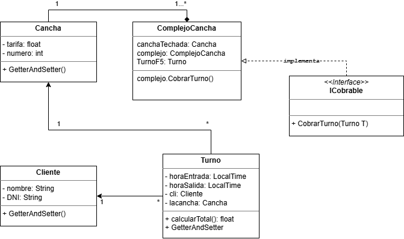

# SOLUCION A LA ACTIVIDAD 9 DE POO

## DIAGRAMA UML


## CODIGO

### CLASE MAIN ComplejoCancha
```java
public class ComplejoCancha implements ICobrable{
    
     @Override
    public void CobrarTurno(Turno t) {
        System.out.println("====== PAGO ADELANTADO (AUTORIZADO) ======");
        System.out.println("Responsable: " + t.getCli());
        System.out.println("Cancha: Nro " + t.getLacancha().getNumero());
        System.out.println("Horario reservado: de " + t.getHoraSalida().minusMinutes((long)(t.calcularTotal()/t.getLacancha().getTarifa()*60)) + " a " + t.getHoraSalida()); 
        System.out.println("Total pagado: $" + t.calcularTotal());
        System.out.println("==========================================");
    }
    
    
    /**
     * @param args the command line arguments
     */
    public static void main(String[] args) {
         ComplejoCancha complejo = new ComplejoCancha();
        
        Cancha canchaTechada = new Cancha(3, 8000.0f);
        Cliente responsable = new Cliente("Marcos Paz");

        Turno turnoF5 = new Turno(LocalTime.of(20, 0), LocalTime.of(22, 0), "Marcos Paz", canchaTechada);

        complejo.CobrarTurno(turnoF5);//se cobra antes de jugar
    }
}
```

### INTERFAZ ICOBRABLE
```java
public interface ICobrable {
    void CobrarTurno(Turno T);
}
```

### CLASE TURNO
```java
public class Turno {
    
    private LocalTime horaEntrada;
    private LocalTime horaSalida;
    private String cli;
    private Cancha lacancha;
    
    
    float calcularTotal(){
     if (horaEntrada == null || horaSalida == null) {
            return 0.0f;
        }
        long minusMinutes = ChronoUnit.MINUTES.between(horaEntrada, horaSalida);
        float horasCalculadas = minusMinutes /60.0f;
        return  horasCalculadas * lacancha.getTarifa();
    }

    public Turno(LocalTime horaEntrada, LocalTime horaSalida, String cli, Cancha lacancha) {
        this.horaEntrada = horaEntrada;
        this.horaSalida = horaSalida;
        this.cli = cli;
        this.lacancha = lacancha;
    }

    public LocalTime getHoraEntrada() {
        return horaEntrada;
    }

    public void setHoraEntrada(LocalTime horaEntrada) {
        this.horaEntrada = horaEntrada;
    }

    public LocalTime getHoraSalida() {
        return horaSalida;
    }

    public void setHoraSalida(LocalTime horaSalida) {
        this.horaSalida = horaSalida;
    }

    public String getCli() {
        return cli;
    }

    public void setCli(String cli) {
        this.cli = cli;
    }

    public Cancha getLacancha() {
        return lacancha;
    }

    public void setLacancha(Cancha lacancha) {
        this.lacancha = lacancha;
    }
}
```

### CLASE CLIENTE
```java
public class Cliente {
    private String nombre;
    private String DNI;

    public Cliente() {
    }

    public Cliente(String nombre) {
        this.nombre = nombre;
        this.DNI = DNI;
    }

    public String getNombre() {
        return nombre;
    }

    public void setNombre(String nombre) {
        this.nombre = nombre;
    }

    public String getDNI() {
        return DNI;
    }

    public void setDNI(String DNI) {
        this.DNI = DNI;
    }    
}
```
### CLASE CANCHA
```java
public class Cancha {
    private float tarifa;
    private int numero;

    public Cancha(int numero ,float tarifa) {
        this.tarifa = tarifa;
        this.numero = numero;
    }

    public float getTarifa() {
        return tarifa;
    }

    public void setTarifa(float tarifa) {
        this.tarifa = tarifa;
    }

    public int getNumero() {
        return numero;
    }

    public void setNumero(int numero) {
        this.numero = numero;
    }
}
```