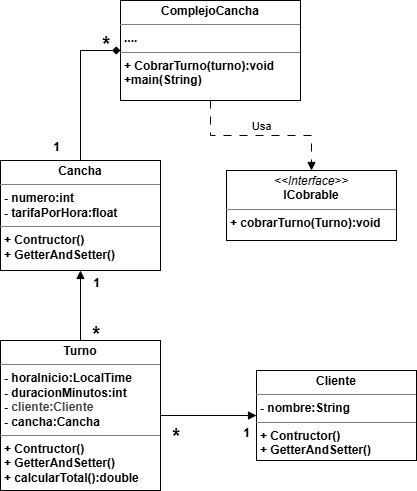

# Actividad 09 - Canchas Orientadas a Objetos

## main
```java
package canchafutbol5;
import java.time.LocalTime;
/**
 * @author Profe
 */
public class ComplejoCanchas implements ICobrable {
    
    @Override
    public void cobrarTurno(Turno t) {
        System.out.println("====== PAGO ADELANTADO (AUTORIZADO) ======");
        System.out.println("Responsable: " + t.getCliente().getNombre());
        System.out.println("Cancha: Nro " + t.getCancha().getNumero());
        System.out.println("Horario reservado: de " + t.getHoraFin().minusMinutes((long)(t.calcularTotal()/t.getCancha().getTarifaPorHora()*60)) + " a " + t.getHoraFin()); 
        System.out.println("Total pagado: $" + t.calcularTotal());
        System.out.println("==========================================");
    }

    public static void main(String[] args) {
        ComplejoCanchas complejo = new ComplejoCanchas();
        
        Cancha canchaTechada = new Cancha(3, 8000.0f);
        Cliente responsable = new Cliente("Marcos Paz");

        Turno turnoF5 = new Turno(LocalTime.of(20, 0), 90, responsable, canchaTechada);

        complejo.cobrarTurno(turnoF5);//se cobra antes de jugar
    }    
}
```
## Cancha
```java
package complejocanchas;
class Cancha {
 private int numero;
    private float tarifaPorHora;

    public Cancha(int numero, float tarifaPorHora) {
        this.numero = numero;
        this.tarifaPorHora = tarifaPorHora;
    }

    public int getNumero() {
        return numero;
    }

    public float getTarifaPorHora() {
        return tarifaPorHora;
    }

    public void setNumero(int numero) {
        this.numero = numero;
    }

    public void setTarifaPorHora(float tarifaPorHora) {
        this.tarifaPorHora = tarifaPorHora;
    }
  
}
```
## Cliente
```java
package complejocanchas;
/**
 *
 * @author jogag
 */
class Cliente {
private String Nombre;

    public Cliente() {
    }

    public Cliente(String Nombre) {
        this.Nombre = Nombre;
    }

    public String getNombre() {
        return Nombre;
    }

    public void setNombre(String Nombre) {
        this.Nombre = Nombre;
    }
 
}
```
## ICobrable
```java
package complejocanchas;

/**
 *
 * @author jogag
 */
interface ICobrable {
 void cobrarTurno(Turno t);   
}

```
## Turno
```java
package complejocanchas;

import java.time.LocalTime;

/**
 *
 * @author jogag
 */
class Turno {

    private LocalTime horaInicio;
    private int duracionMinutos;
    private Cliente cliente;
    private Cancha cancha;

    public Turno(LocalTime horaInicio, int duracionMinutos, Cliente cliente, Cancha cancha) {

        this.horaInicio = horaInicio;
        this.duracionMinutos = duracionMinutos;
        this.cliente = cliente;
        this.cancha = cancha;
    }

    public LocalTime getHoraInicio() {
        return horaInicio;
    }

    public LocalTime getHoraFin() {
        return horaInicio.plusMinutes(duracionMinutos);
    }

    public Cliente getCliente() {
        return cliente;
    }

    public Cancha getCancha() {
        return cancha;
    }

    public double calcularTotal() {
        return (duracionMinutos / 60.0) * cancha.getTarifaPorHora();
    }

}
```
# UML
